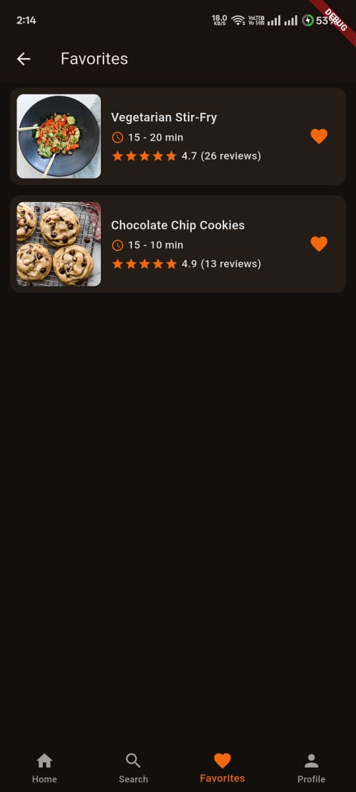
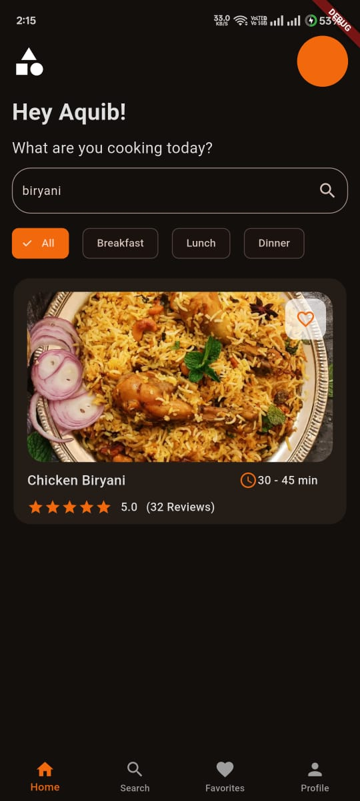
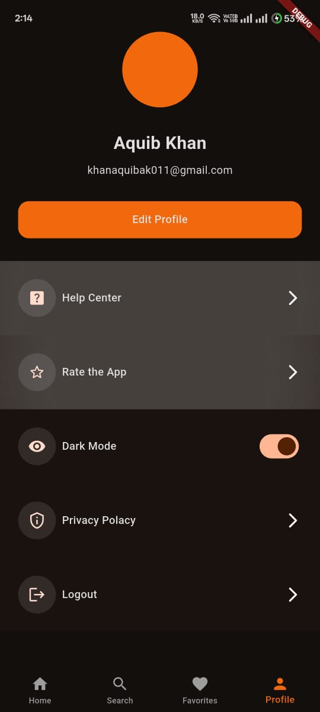

# 🍳 Recipe App  


A **cross-platform mobile app** built with **Flutter** to explore, search, and save tasty recipes.  
It features a clean UI, light & dark themes, debounced search, image caching, and favorites.

---

## ✨ Features
- 🔍 **Search with debouncing** for a smooth, responsive experience  
- 🖼️ **Cached network images** for faster loading  
- ❤️ **Add to favorites** to save recipes you love  
- 🎨 **Clean UI** with **Light & Dark mode**  
- 🌐 **Data fetched using a fake API**  

---

## 🛠️ Tech Stack
- **Flutter (Dart)**
- **Provider** – state management
- **REST API** – data fetching
- **Git & GitHub** – version control

---

## 📱 Screenshots

### 🔑 Auth Screens
<p>
  
  
</p>

### 🏠 App Screens
<p>
  
  
  
  
</p>

### ⚙️ Settings Screen
<p>
  
</p>

---

## 🚀 Getting Started

### ✅ Prerequisites
- Install the **Flutter SDK** and set up your environment  
- An IDE like **Android Studio** or **VS Code**  
- An emulator/simulator or a physical device

### ✅ Steps to Run
1. **Clone the repository**
   ```bash
   git clone https://github.com/Aquib-ig/recipe_app.git
   cd recipe_app
   ```
2. **Install dependencies**
   ```bash
   flutter pub get
   ```
3. **(Optional) Verify your setup**
   ```bash
   flutter doctor
   ```
4. **Run the app**
   ```bash
   flutter run
   ```

### 📦 Build (optional)
- **Android (release APK)**
  ```bash
  flutter build apk --release
  ```
- **iOS (release)**
  ```bash
  flutter build ios --release
  ```
  > On macOS with Xcode configured.

---

## 👨‍💻 Author

**Aquib Khan**  
- GitHub: [Aquib-ig](https://github.com/Aquib-ig)  
- LinkedIn: [Aquib Khan](https://www.linkedin.com/in/aquib-khan-454049253)

---

## 📜 License
This project is available under the **MIT License**. Feel free to use and modify.
